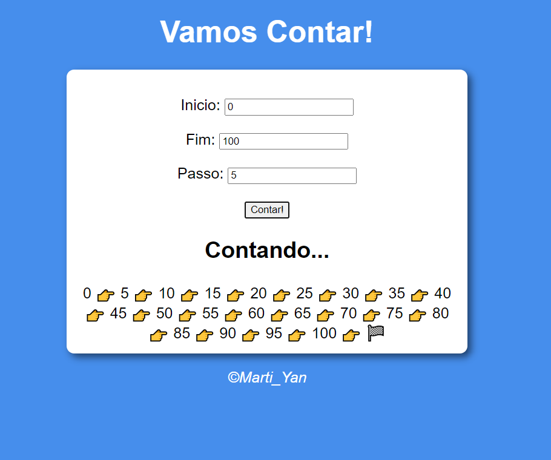
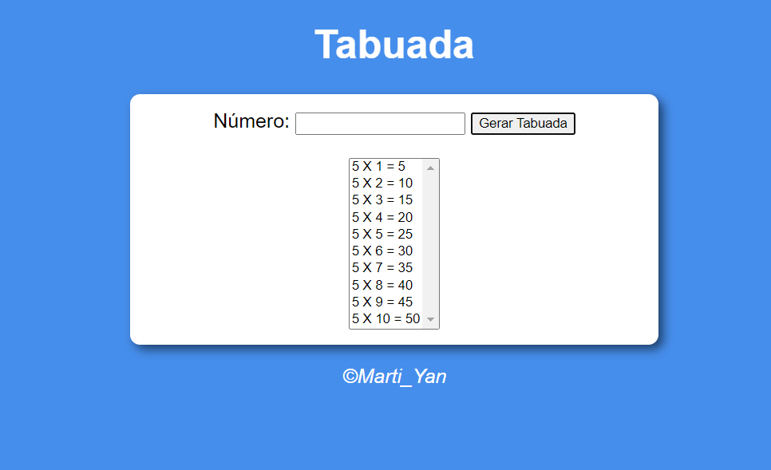
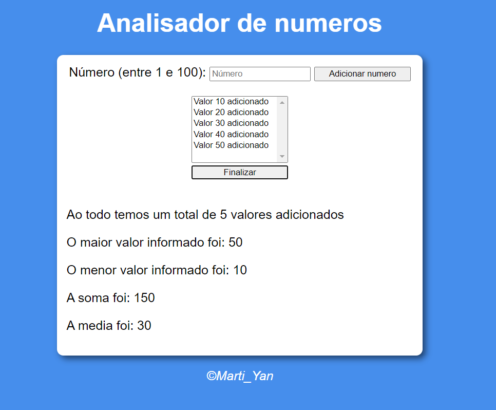

<h1 style="text-align:center"> Bem vindo </h1>
<h2 style="text-align:center"> Modulo D - Condições</h2>

<h3 style="text-align:center">  Exercicios 1 </h3>

 
<h3 style="text-align:center">  Exercicios 2 </h3>

 

<h2 style="text-align:center"> Modulo E - Repetições</h2>

 
<h3 style="text-align:center">  Exercicios 1 </h3>

 
 
<h3 style="text-align:center">  Exercicios 2 </h3>

  

<h2 style="text-align:center"> Modulo F - Arrays&functions</h2>

